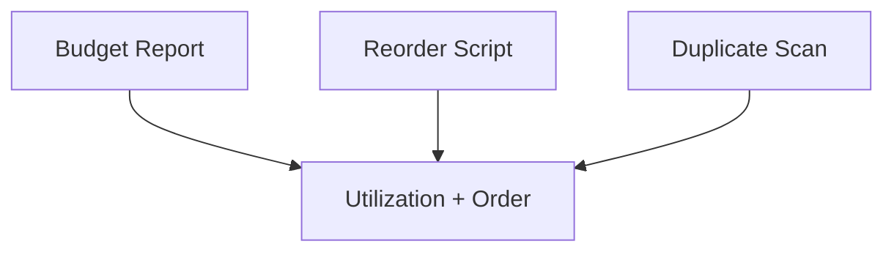

# Expected Outputs

Recorded from local runs with current scripts (heuristic).

## Context Budget Report

- Artifacts: 6
- Budget: 400
- Estimated total: 129
- Utilization: 32.2%
- Breakdown (tokens):
  - system_prompt: 25
  - task: 24
  - message_history: 54
  - retrieved_documents: 0
  - tool_outputs: 26
  - other: 0
- Admission order:
  1. sys
  2. policy
  3. hist1
  4. hist2
  5. hist3
  6. log1

## Reorder by Priority

Order matches budget report: sys > policy > hist1 > hist2 > hist3 > log1.

## Duplicate Scan

- Exact duplicates: none
- Near-duplicates: none with `--near-threshold 0.9 --shingle-k 4`

Note: Outputs are heuristic. Re-run after script changes.
