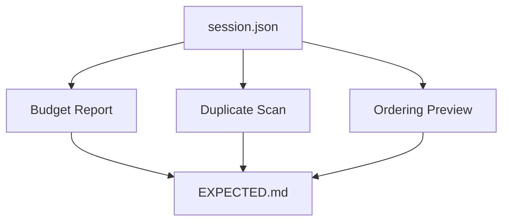

# Long Session Stability Harness — Fixtures

Use `session.json` to simulate long-history pressure and exercise triage scripts.



## Contents

- `session.json` — system + policy constraints, 3-turn user history with PII, and a verbose tool log.
- `EXPECTED.md` — placeholder for expected outputs; update after running scripts locally.

## How to run (demo)

From repo root:

```bash
python3 skills/operator/context-triage/scripts/context_budget_report.py --input examples/long-session-stability-harness/fixtures/session.json --budget 400

python3 skills/operator/context-triage/scripts/duplicate_scan_demo.py --input examples/long-session-stability-harness/fixtures/session.json --near-threshold 0.9 --shingle-k 4

python3 skills/operator/context-triage/scripts/reorder_by_priority.py --input examples/long-session-stability-harness/fixtures/session.json
```

## Expected highlights (heuristic)

- **Budget report**: Tool log and history drive most token use; constraints remain small but must be elevated.
- **Duplicate scan**: No exact dupes; near-dup pairs unlikely unless thresholds lowered.
- **Reorder**: Ordering should be `sys` > `policy` > history messages > tool log, reflecting authority/kind weights.

These scripts are demos with heuristic scoring. Use them to validate orchestration, not production tokenization or policy.

Update `EXPECTED.md` with actual outputs from your environment after running the scripts.
