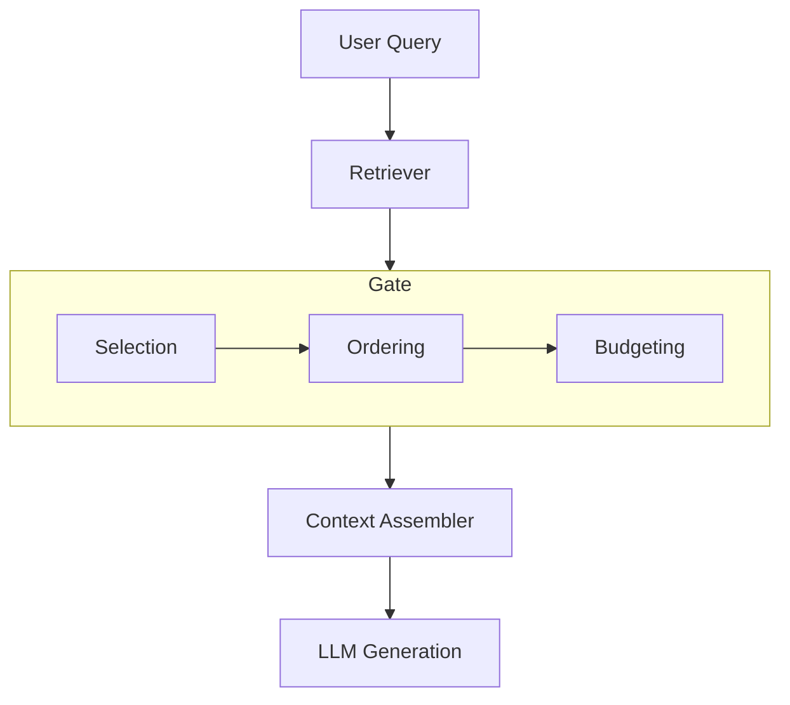

# Product Requirements — Minimal RAG Context Gate

**Goal**: Demonstrate robust context control for a Retrieval-Augmented Generation (RAG) system by applying selection, ordering, and budgeting rules to retrieved documents and other context artifacts before they are sent to the language model for generation.

## Requirements

### Functional Requirements
- **FR1: Artifact Ingestion**: The system must accept a bundle of context `Artifacts`. Each artifact must have a clearly defined `kind` (e.g., `system`, `task`, `message`, `document`), `authority`, and `priority`.
- **FR2: Relevance-Based Selection**: The system must filter out `document` artifacts that are not relevant to the user's query. A simple keyword overlap score will be used as the primary relevance metric.
- **FR3: Authority-Based Ordering**: Artifacts must be sorted in descending order based on a weighted score derived from their `authority`, `kind`, and `priority`. This ensures that high-priority items (like system prompts) appear before lower-priority items (like retrieved documents).
- **FR4: Token Budget Enforcement**: The system must enforce a configurable token budget. Artifacts are added to the context one by one according to their rank, and the process stops when the budget is reached.
- **FR5: Document Cap**: The system must enforce a configurable limit on the maximum number of `document` artifacts that can be included in the context.
- **FR6: Context Assembly**: The system must assemble the final, admitted artifacts into a single, formatted string ready for the language model.
- **FR7: Exclusion Logging**: The system must produce a log of all artifacts that were excluded, along with the reason for their exclusion (e.g., `out_of_scope`, `budget`, `doc_cap`).

### Non-Functional Requirements
- **NFR1: Configurability**: The token budget and maximum document count must be configurable at runtime.
- **NFR2: Predictability**: The gating logic must be deterministic. Given the same input bundle and configuration, the output must always be identical.
- **NFR3: Extensibility**: The scoring and weighting logic should be easy to modify or extend to accommodate new artifact kinds or authorities.

## Key Scenarios
- **Scenario 1: High-Priority Task**: A `task` artifact with high priority should be included even if it means excluding several lower-priority `document` artifacts.
- **Scenario 2: Budget Exceeded**: When the total token count of all artifacts exceeds the budget, the system should gracefully truncate the context by dropping the lowest-ranked artifacts.
- **Scenario 3: Irrelevant Documents**: Documents that have no topical overlap with the user's query should be filtered out early in the process.
- **Scenario 4: Too Many Documents**: If the number of retrieved documents exceeds the `max_docs` limit, only the highest-ranked documents (after relevance filtering) should be included.

## Out of Scope
- Advanced retrieval strategies (e.g., query expansion, vector search).
- Fine-tuning the language model for the specific task.
- Integration with third-party APIs or services.
