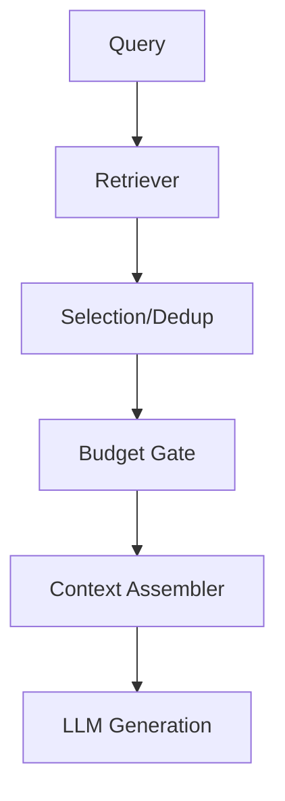

# Product Requirements — Minimal RAG Context Gate

Goal: demonstrate selection, ordering, masking, and validation on retrieved context before generation.

## Requirements
- Input: user query + retrieved documents.
- Controls: selection, ordering, masking of rubrics/system constraints, optional validation of cached retrieval.
- Output: ordered context assembly + generation result + logs.
- Tests: ordering invariance, budget enforcement, masking correctness.

## Non-Goals
- Retriever quality benchmarking.
- Prompt optimization beyond gating steps.
- Vendor-specific integrations.
