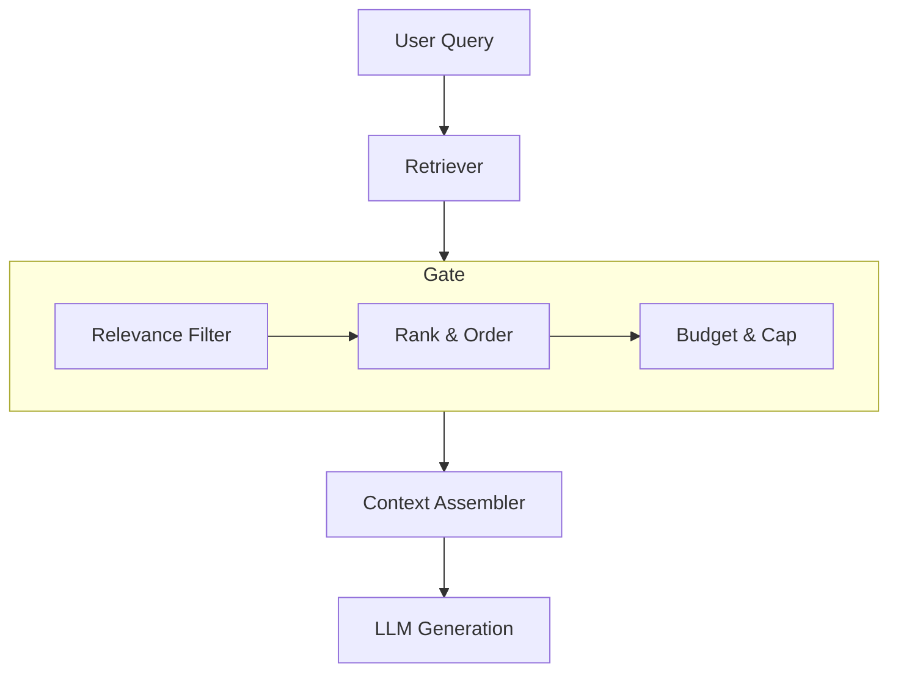

# Minimal RAG Context Gate

This example demonstrates a "Context Gate" for a Retrieval-Augmented Generation (RAG) system. It shows how to apply a series of controls—**Selection**, **Ordering**, **Budgeting**, and **Validation**—to a bundle of retrieved documents and other context before it's sent to a language model.

The goal is to create a well-formed, relevant, and budget-conscious context that improves the quality and reliability of the model's output.

- **PRD**: [Product Requirements Document](./PRD.md)

## Architecture

The context gate sits between the retriever and the generator, acting as a control point.



## Key Scenarios Demonstrated

This harness is designed to address several common challenges in RAG systems:

-   **Scenario 1: Irrelevant Documents**: The retriever returns documents that are only tangentially related to the user's query. The context gate filters these out based on a relevance score, reducing noise.
-   **Scenario 2: Budget Overrun**: The retrieved documents are too verbose and exceed the model's context window. The gate enforces a strict token budget, dropping the least important documents to ensure the context fits.
-   **Scenario 3: Loss of Control**: Important instructions (like the system prompt) get lost in a sea of retrieved text. The gate's ordering logic ensures that high-authority artifacts like `system` and `task` prompts are always placed first.
-   **Scenario 4: Document Overload**: The retriever returns dozens of documents. The gate enforces a hard cap on the number of documents to prevent them from drowning out the user's actual query.

## How It Works

The core logic is implemented in a series of gating steps, processing a bundle of artifacts.

### 1. Input Bundle (`fixtures/bundle.json`)

The process starts with a JSON bundle containing all potential context artifacts. Each artifact has metadata (`kind`, `authority`, `priority`) that the gate uses to make decisions.

```json
{
  "artifacts": [
    {
      "id": "sys",
      "kind": "system",
      "authority": "system",
      "priority": 10,
      "title": "System Instruction",
      "content": "You are a focused retrieval assistant. Always cite sources."
    },
    {
      "id": "task",
      "kind": "task",
      "authority": "developer",
      "priority": 8,
      "title": "Task",
      "content": "Answer the user's question based only on retrieved documents."
    },
    {
      "id": "doc1",
      "kind": "document",
      "authority": "tool",
      "priority": 5,
      "title": "Doc 1",
      "content": "The capital of France is Paris. It is known for the Eiffel Tower."
    },
    {
      "id": "doc2",
      "kind": "document",
      "authority": "tool",
      "priority": 4,
      "title": "Doc 2",
      "content": "France uses the Euro as its currency. The capital city is Paris."
    },
    {
      "id": "doc3",
      "kind": "document",
      "authority": "tool",
      "priority": 1,
      "title": "Doc 3",
      "content": "This is a verbose marketing paragraph with little relevant information about travel offers."
    },
    {
      "id": "user",
      "kind": "message",
      "authority": "user",
      "priority": 2,
      "title": "User Question",
      "content": "What is the capital of France?"
    }
  ]
}
```

### 2. The Gating Process (`src/gates.py`)

The `gate_bundle` function applies a sequence of controls to the input artifacts. It filters, ranks, and selects artifacts based on relevance, authority, and token budget.

```python
# From: src/gates.py

def gate_bundle(
    bundle: Dict[str, Any],
    budget_tokens: int = 120,
    max_docs: int = 3,
) -> Tuple[List[Artifact], List[Tuple[Artifact, str]]]:
    """
    Applies a minimal selection/ordering/budget gate.

    Returns (admitted, excluded_with_reason).
    """
    artifacts = load_bundle(bundle)
    if not artifacts:
        return [], []

    # Identify user question for simple relevance check
    user_q = next((a.content for a in artifacts if a.kind == "message"), "")

    counter = HeuristicTokenCounter()
    admitted: List[Artifact] = []
    excluded: List[Tuple[Artifact, str]] = []

    # 1. Relevance Filtering: Drop documents with no keyword overlap.
    filtered: List[Artifact] = []
    for a in artifacts:
        if a.kind == "document":
            rel = _relevance_score(a.content, user_q)
            if rel == 0:
                excluded.append((a, "out_of_scope"))
                continue
        filtered.append(a)

    # 2. Ranking: Sort by authority, kind, and priority.
    ranked = sorted(filtered, key=score, reverse=True)

    # 3. Budgeting and Capping: Admit artifacts until budget or doc cap is hit.
    used = 0
    doc_count = 0
    for a in ranked:
        t = counter.count(a.content)
        if t == 0:
            excluded.append((a, "empty"))
            continue
        if a.kind == "document":
            doc_count += 1
            if doc_count > max_docs:
                excluded.append((a, "doc_cap"))
                continue
        if used + t > budget_tokens:
            excluded.append((a, "budget"))
            continue
        admitted.append(a)
        used += t

    return admitted, excluded
```

### 3. Assembly (`src/context_assembler.py`)

The `assemble_context` function takes the artifacts that passed the gate and formats them into a clean string with clear `Boundaries` for the LLM.

```python
# From: src/context_assembler.py

def assemble_context(artifacts: List[Artifact]) -> str:
    """
    Produces a simple ordered context string for demo/testing.
    System/developer/tasks appear first by virtue of pre-ordering in inputs.
    """
    parts: List[str] = []
    for a in artifacts:
        parts.append(f"[{a.kind}:{a.artifact_id}] {a.content}")
    return "\n".join(parts)
```

## How to Run

You can run the example from the root of the repository:

```bash
python -m examples.minimal-rag-context-gate.src.runner
```

### Example Output (Default Budget)

The script processes `fixtures/bundle.json` with a **120-token budget**.

```
[system:sys] You are a focused retrieval assistant. Always cite sources.
[task:task] Answer the user's question based only on retrieved documents.
[message:user] What is the capital of France?
[document:doc1] The capital of France is Paris. It is known for the Eiffel Tower.
[document:doc2] France uses the Euro as its currency. The capital city is Paris.

Admitted: 5  Excluded: 1
- doc3 (out_of_scope)
```
- **The Assembled Context**: The final context is well-ordered and within budget.
- **`doc3` was excluded**: The document about marketing was correctly identified as irrelevant (`out_of_scope`) and filtered out.

### Example Output (Reduced Budget)

If we run the gate with a **60-token budget**, we see the budgeting control in action.

```
[system:sys] You are a focused retrieval assistant. Always cite sources.
[task:task] Answer the user's question based only on retrieved documents.

Admitted: 2  Excluded: 4
- doc3 (out_of_scope)
- user (budget)
- doc1 (budget)
- doc2 (budget)
```
- **`user`, `doc1` and `doc2` were excluded**: Even though they are relevant, they were excluded because including them would have exceeded the 60-token budget. The gate prioritized the higher-authority system and task prompts.

## Key Takeaways

-   **Don't Trust Your Retriever**: Assume your retriever will be noisy and return irrelevant results. A context gate is your defense.
-   **Prioritize Ruthlessly**: Not all context is created equal. Use a clear hierarchy of authority and priority to decide what to keep and what to discard.
-   **Budgets are Essential**: Enforcing a token budget prevents context window errors and makes your system's behavior more predictable.
-   **Boundaries Matter**: Clearly demarcating the different parts of your context helps the model understand their roles and relationships.