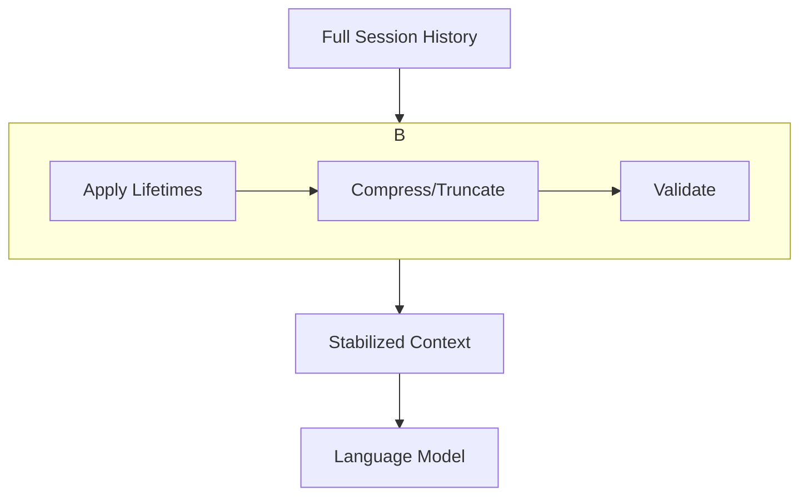

# Pattern: Long-Running Context Stability

This pattern addresses the challenge of maintaining a coherent and useful context over a long-running, multi-turn conversation with an AI. Without explicit management, a long conversation history can lead to several problems.

**Related Example**: A concrete, runnable implementation of this pattern can be found in the `long-session-stability-harness`.

## 1. Problem

As a conversation with an agent continues, the context window grows, leading to:

1.  **Context Budget Exceeded**: The history exceeds the model's maximum context window, causing errors.
2.  **Context Drift**: The model loses track of the original instructions as early messages are pushed out of view.
3.  **PII / Sensitive Data Exposure**: Sensitive data mentioned early in the conversation can persist, increasing risk.
4.  **Increased Latency and Cost**: Sending a very large context on every turn increases inference time and cost.

## 2. Solution

The solution is to implement a **Context Stabilizer** that programmatically processes the session history before each turn. This stabilizer acts as a filter and compressor, applying a set of rules to keep the context relevant, clean, and within budget.



## 3. Key Artifacts

The pipeline operates on a list of `Artifact` objects, each representing a turn in the conversation.

```python
class Artifact:
    """Represents one item in the conversation history."""
    def __init__(self, kind: str, content: str, token_count: int):
        # kind can be "system", "user", "assistant", "tool"
        self.kind = kind
        self.content = content
        self.token_count = token_count
```

## 4. Example Pipeline

This pseudo-code shows how a stabilizer can be implemented with simple, heuristic-based controls.

```python
# pseudo-code

def stabilize_context(history: list[Artifact], budget: int) -> list[Artifact]:
    """
    Applies stability controls to a conversation history.
    """
    # 1. Always preserve the system prompt and the most recent message.
    system_prompt = next(a for a in history if a.kind == "system")
    last_message = history[-1]
    
    # 2. Separate the intermediate history for processing.
    intermediate_history = history[1:-1]

    # 3. Mask PII in the intermediate history.
    for artifact in intermediate_history:
        if artifact.kind == "user":
            artifact.content = mask_pii(artifact.content)

    # 4. Compress the intermediate history using heuristics.
    #    - Drop verbose tool outputs.
    #    - Keep user messages.
    compressed_history = []
    for artifact in intermediate_history:
        if artifact.kind == "tool" and artifact.token_count > 256:
            continue # Skip verbose tool output
        compressed_history.append(artifact)

    # 5. Assemble the final context within the token budget.
    final_artifacts = [system_prompt]
    token_count = system_prompt.token_count

    # Add historical messages from oldest to newest if they fit.
    for artifact in compressed_history:
        if token_count + artifact.token_count < budget - last_message.token_count:
            final_artifacts.append(artifact)
            token_count += artifact.token_count
    
    final_artifacts.append(last_message)
    
    # 6. Validate the result.
    assert (token_count + last_message.token_count) <= budget
    assert validate_no_pii(final_artifacts)

    return final_artifacts

def mask_pii(text: str) -> str:
    # A simple regex-based masking function
    return re.sub(r'\d{3}-\d{2}-\d{4}', '[REDACTED_SSN]', text)
```

## 5. Example Walkthrough

Consider a long conversation where a user has shared sensitive data and a tool has produced verbose output.

**History (Before Stabilization):**
1.  `system`: "You are a helpful assistant."
2.  `user`: "I need help with my account. My SSN is 123-45-6789."
3.  `assistant`: "I see. Let me look that up."
4.  `tool`: (A 500-token JSON blob is returned)
5.  `user`: "Okay, so what's the status of my last order?"

**Stabilization Process:**
1.  **Preservation**: The `system` prompt and the last `user` message ("...what's the status...") are set aside to be unconditionally included.
2.  **PII Masking**: The `user` message at index 2 is processed, and "123-45-6789" is replaced with "[REDACTED_SSN]".
3.  **Compression**: The `tool` output at index 4 is identified as being over the 256-token limit for tool outputs, and it is dropped from the history.
4.  **Assembly**: The stabilizer assembles the final context:
    - It starts with the `system` prompt.
    - It adds the masked message from the user.
    - It adds the assistant's response.
    - Finally, it adds the most recent user query.
    - It confirms the total token count is within the budget.

**Final Context (After Stabilization):**
1.  `system`: "You are a helpful assistant."
2.  `user`: "I need help with my account. My SSN is [REDACTED_SSN]."
3.  `assistant`: "I see. Let me look that up."
4.  `user`: "Okay, so what's the status of my last order?"

This stabilized context preserves the flow of the conversation while being smaller, cheaper, safer, and more focused.
