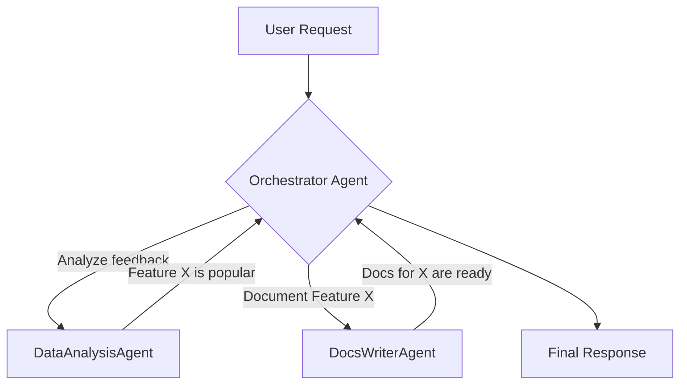

# Pattern: Multi-Agent Orchestration

This pattern addresses the challenge of solving complex problems by coordinating multiple specialized AI agents. Instead of relying on a single, general-purpose agent, a "meta-agent" or "orchestrator" routes tasks to the most appropriate specialist agent.

## 1. Problem

A single agent, even with a rich set of tools, can become inefficient or confused when tasked with a problem that spans multiple domains. A request like "Analyze our latest customer feedback, update the documentation, and then draft a blog post" involves three distinct skills: data analysis, technical writing, and marketing. A single agent trying to handle this performs poorly.

## 2. Solution

The solution is to create a multi-agent system with a dedicated **Orchestrator**.

1.  **Orchestrator Agent**: A high-level agent that analyzes the user's request, breaks it down into sub-tasks, and routes them to the right specialist.
2.  **Specialized Agents**: A collection of agents, each with a narrow, well-defined purpose and a limited set of tools.

The Orchestrator passes control and a tightly-scoped context to a specialized agent for each sub-task.



## 3. Key Artifacts

**Agent Interface:** A common interface that the Orchestrator uses to interact with all specialized agents.
```python
from abc import ABC, abstractmethod

class Agent(ABC):
    @abstractmethod
    def name(self) -> str:
        """A unique name for the agent."""
        pass

    @abstractmethod
    def description(self) -> str:
        """A description of what the agent is specialized in."""
        pass

    @abstractmethod
    def run(self, input_context: str) -> str:
        """Runs the agent with a given context and returns the result."""
        pass
```

**Task and Result Dictionaries:** The orchestrator uses simple dictionaries to track the plan and the outputs.
```python
# A plan generated by the orchestrator's first step
sub_tasks = [
    {"task_id": 1, "agent_name": "DataAnalysisAgent", "input": "latest customer feedback"},
    {"task_id": 2, "agent_name": "DocsWriterAgent", "input": "results from task 1"},
]

# A dictionary to store the results from each agent
results = {
    1: "Analysis complete. Users are asking for Feature X.",
    2: "Documentation for Feature X has been updated."
}
```

## 4. Example Pipeline

This pseudo-code shows how an orchestrator might be implemented.

```python
# pseudo-code

class Orchestrator:
    def __init__(self, agents: list[Agent]):
        self.agents = {agent.name(): agent for agent in agents}
        self.llm = # An LLM for reasoning steps

    def handle_request(self, user_request: str) -> str:
        # 1. Decompose the request into a sequence of sub-tasks.
        # This is a critical reasoning step performed by the orchestrator's LLM.
        prompt = f"Given the user request '{user_request}' and the available agents, create a JSON plan..."
        plan_json = self.llm.generate(prompt) # Returns a list of sub_tasks
        sub_tasks = json.loads(plan_json)

        # 2. Execute the plan.
        results = {}
        for task in sub_tasks:
            agent = self.agents.get(task["agent_name"])
            if not agent:
                continue

            # 3. Define the scope and run the agent in isolation.
            input_context = self.prepare_context(task, results)
            result = agent.run(input_context)
            results[task["task_id"]] = result

        # 4. Synthesize the final response.
        return self.synthesize_results(results)

    def prepare_context(self, task: dict, previous_results: dict) -> str:
        """Gathers input from the original request or previous results."""
        # This is another key control, managing the Scope of context for the specialist.
        if "results from task" in task["input"]:
            source_task_id = int(task["input"].split(" ")[-1])
            return previous_results.get(source_task_id, "")
        return task["input"] # From original user request
```

## 5. Example Walkthrough

Let's trace the request: **"Analyze our latest customer feedback, update the docs for new features, and draft a blog post."**

1.  **DECOMPOSE**: The Orchestrator's LLM receives the request and the list of available agents (`DataAnalysisAgent`, `DocsWriterAgent`, `MarketingAgent`). It produces a plan:
    1.  Call `DataAnalysisAgent` with the feedback data.
    2.  Call `DocsWriterAgent` with the output of the analysis.
    3.  Call `MarketingAgent` with the output of the analysis.

2.  **EXECUTE (Task 1)**: The Orchestrator calls `DataAnalysisAgent`.
    -   **Context**: "Analyze the following feedback: ..."
    -   **Result**: "Analysis shows a high demand for 'Feature X'."
    -   The result is stored in `results[1]`.

3.  **EXECUTE (Task 2)**: The Orchestrator calls `DocsWriterAgent`.
    -   **Context**: "Write documentation for the following feature: 'Feature X'." (Prepared from the result of Task 1).
    -   **Result**: "Documentation for Feature X is complete and saved."
    -   The result is stored in `results[2]`.

4.  **EXECUTE (Task 3)**: The Orchestrator calls `MarketingAgent`.
    -   **Context**: "Draft a blog post announcing the launch of 'Feature X'."
    -   **Result**: "Draft complete: 'Announcing Feature X: The aait is Over!'"
    -   The result is stored in `results[3]`.

5.  **SYNTHESIZE**: The Orchestrator confirms all tasks are complete and provides a final summary to the user: "Process complete. The data has been analyzed, documentation updated, and a blog post has been drafted."

