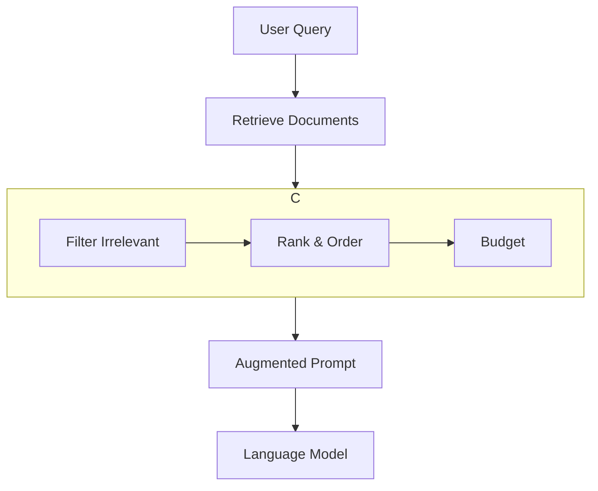

# Pattern: Retrieval-Augmented Generation (RAG)

Retrieval-Augmented Generation (RAG) is a pattern that grounds a language model's responses in external, up-to-date knowledge. It's a powerful technique for building applications that can answer questions about specific documents or data that was not included in the model's original training.

**Related Example**: A concrete, runnable implementation of this pattern can be found in the `minimal-rag-context-gate`.

## 1. Problem

Language models have a knowledge cut-off and are not aware of your private or proprietary data. When you ask a general-purpose model a question like "What is our company's policy on remote work?", it will either not know the answer or it will hallucinate one. This leads to inaccurate answers and a lack of verifiability.

## 2. Solution

RAG solves this by creating a two-step process: **Retrieve**, then **Generate**. Before the language model is invoked, the system retrieves relevant information from a knowledge source. This retrieved information is then added to the user's query as context, ensuring the model's response is grounded in the provided information.

A robust RAG system includes a **Context Gate** between the retrieval and generation steps to control the quality of the context.



## 3. Key Artifacts

The RAG pipeline operates on a few key data structures.

**Retrieved Document:** A simple data structure representing a piece of text retrieved from the knowledge base.
```python
class Document:
    def __init__(self, id: str, text: str, relevance_score: float):
        self.id = id
        self.text = text
        self.relevance_score = relevance_score
```

**Context Bundle:** A dictionary containing all the information that needs to be processed by the context gate.
```json
{
    "system_prompt": "You are an expert Q&A assistant...",
    "user_query": "What is the capital of France?",
    "documents": [
        {"id": "doc1", "text": "Paris is the capital of France...", "score": 0.95},
        {"id": "doc2", "text": "Fish live in water...", "score": 0.12}
    ]
}
```

## 4. Example Pipeline

This pseudo-code shows a RAG pipeline with a detailed context gate.

```python
# pseudo-code

def answer_question(query: str, vector_db, llm):
    """
    Executes a RAG pipeline with a context gate.
    """
    # 1. Retrieve: Get potentially relevant documents
    retrieved_docs = vector_db.search(query, top_k=10)

    # 2. Gate: Apply context controls
    context_bundle = {
        "system_prompt": "You are an expert Q&A assistant...",
        "user_query": query,
        "documents": retrieved_docs
    }
    gated_artifacts = context_gate(context_bundle, budget=4096, relevance_threshold=0.5)

    # 3. Generate: Assemble the final prompt and call the LLM
    final_prompt = assemble_prompt(gated_artifacts)
    response = llm.generate(final_prompt)
    return response

def context_gate(bundle: dict, budget: int, relevance_threshold: float) -> dict:
    """
    Filters, orders, and budgets the context.
    """
    # Selection: Filter documents by relevance score
    relevant_docs = [
        doc for doc in bundle["documents"] 
        if doc.relevance_score >= relevance_threshold
    ]

    # Ordering: Sort by score
    sorted_docs = sorted(relevant_docs, key=lambda d: d.relevance_score, reverse=True)

    # Budgeting: Keep adding docs until the token budget is met
    final_docs = []
    token_count = 0
    # Assume system prompt and query are always included
    token_count += len(bundle["system_prompt"]) // 4
    token_count += len(bundle["user_query"]) // 4

    for doc in sorted_docs:
        doc_tokens = len(doc.text) // 4
        if token_count + doc_tokens <= budget:
            final_docs.append(doc)
            token_count += doc_tokens
        else:
            break
            
    return {
        "system_prompt": bundle["system_prompt"],
        "user_query": bundle["user_query"],
        "documents": final_docs
    }

def assemble_prompt(artifacts: dict) -> str:
    """
    Assembles the final prompt with clear boundaries.
    """
    prompt = artifacts["system_prompt"] + "\n\n"
    prompt += "--- Retrieved Documents ---\n"
    for doc in artifacts["documents"]:
        prompt += f"[Source: {doc.id}]\n{doc.text}\n\n"
    prompt += "--- User Query ---\n"
    prompt += artifacts["user_query"]
    return prompt
```

## 5. Example Walkthrough

Let's trace the query **"What is our policy on remote work?"**

1.  **Retrieve**: The system queries the vector database and gets 5 documents. Three are highly relevant, one is marginal, and one is completely irrelevant.
2.  **Gate (Selection)**: The context gate receives the documents. The irrelevant doc (score < 0.5) is immediately discarded.
3.  **Gate (Ordering & Budgeting)**: The remaining 4 documents are ordered by their relevance score. The gate includes the top 3, but finds that adding the 4th would exceed the token budget. It is dropped.
4.  **Assemble**: The final prompt is constructed with the system prompt, the user query, and the 3 documents that passed the gate, all separated by clear boundaries.

This disciplined process ensures that the context provided to the LLM is dense with relevant information and free of noise, leading to a much more accurate and reliable response.
