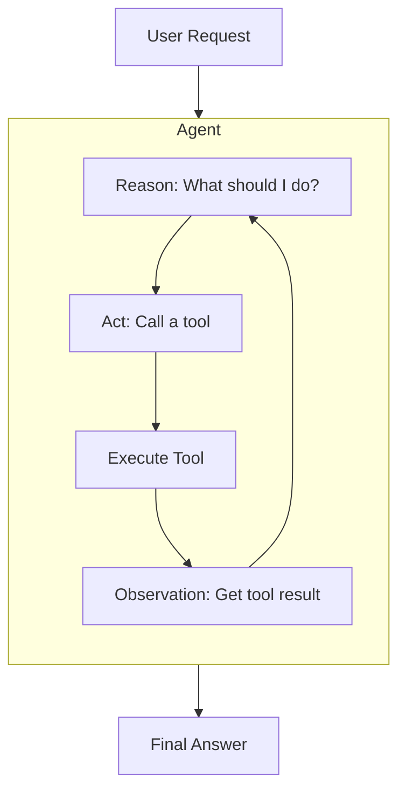

# Pattern: Tool-Using Agent

This pattern enables a language model to interact with the outside world by giving it access to a set of "tools." This overcomes the limitation of LLMs as purely passive text-generators and turns them into active agents that can take actions, gather information, and affect their environment.

**Related Example**: A detailed application of this pattern can be found in the `documentation-assistant` case study.

## 1. Problem

Language models are inherently stateless and isolated. They cannot access real-time information, interact with APIs, or perform calculations. A request like "What's the current weather in London?" will fail because the model has no way to get the necessary information.

## 2. Solution

The solution is to build an **agentic loop** around the language model. This loop gives the model a set of tools and a process for using them, most commonly a **ReAct (Reason + Act)** framework. The model reasons about which tool to use, the system executes it, and the result is fed back to the model to inform its next step.



## 3. Key Artifacts

**Tool Definition:** A class or object that defines a tool's name, description, and execution logic. The description is crucial context for the model.
```python
class WeatherTool:
    def name(self) -> str:
        return "get_weather"
        
    def description(self) -> str:
        return "Gets the current weather for a specified city. Args: city (str)"

    def execute(self, city: str) -> str:
        # In a real system, this would call a weather API
        return f"The weather in {city} is 72°F and sunny."
```

**Agent History:** A running log of the agent's internal monologue and actions, used as context for the next reasoning step.
```
[
    "User Query: What's the weather in London?",
    "Thought: I need to find the weather in London. I should use the get_weather tool.",
    "Action: get_weather(city='London')",
    "Observation: The weather in London is 72°F and sunny."
]
```

## 4. Example Pipeline

This pseudo-code shows a simplified ReAct-style agent loop.

```python
# pseudo-code

def run_agent_loop(user_query: str, tools: list[Tool]):
    """
    A simplified ReAct-style agent loop.
    """
    history = [f"User Query: {user_query}"]
    tool_descriptions = "\n".join([f"- {t.name()}: {t.description()}" for t in tools])

    while True:
        # 1. Reason: The model is prompted to generate its thought and next action.
        prompt = f"""
Available Tools:
{tool_descriptions}

Conversation History:
{history}

Based on the history, what is your next thought and action?
Your action must be a tool call (e.g., `tool_name(arg='value')`) or a final answer.
"""
        response_text = llm.generate(prompt)
        
        thought = parse_thought(response_text)
        action_str = parse_action(response_text)
        history.append(f"Thought: {thought}")
        history.append(f"Action: {action_str}")

        # Check for final answer
        if not is_tool_call(action_str):
            return action_str # This is the final answer

        # 2. Act: Execute the tool call.
        tool_name, tool_args = parse_tool_call(action_str)
        tool = next(t for t in tools if t.name() == tool_name)
        
        # Validation of the tool call happens here.

        # 3. Observe: Get the result and add it to history.
        observation = tool.execute(**tool_args)
        history.append(f"Observation: {observation}")
```

## 5. Example Walkthrough

Let's trace the query: **"What is the weather in London?"**

1.  **REASON (Turn 1)**:
    -   **Input to LLM**: The prompt contains the user query and the description of `get_weather`.
    -   **Output from LLM**:
        ```
        Thought: I need to find the weather in London. The user is asking a direct question that the `get_weather` tool can answer.
        Action: get_weather(city='London')
        ```

2.  **ACT (Turn 1)**: The system parses the `Action` string and calls `WeatherTool.execute(city='London')`. The tool connects to an API and returns the string `"The weather in London is 72°F and sunny."`.

3.  **OBSERVE (Turn 1)**: This string is added to the history.

4.  **REASON (Turn 2)**:
    -   **Input to LLM**: The prompt now contains the original query plus the thought, action, and observation from the first turn.
    -   **Output from LLM**:
        ```
        Thought: I have successfully retrieved the weather information. I can now provide the final answer to the user.
        Action: The current weather in London is 72°F and sunny.
        ```

5.  **FINAL ANSWER**: The system detects that the `Action` is not a tool call and returns it as the final response to the user.
