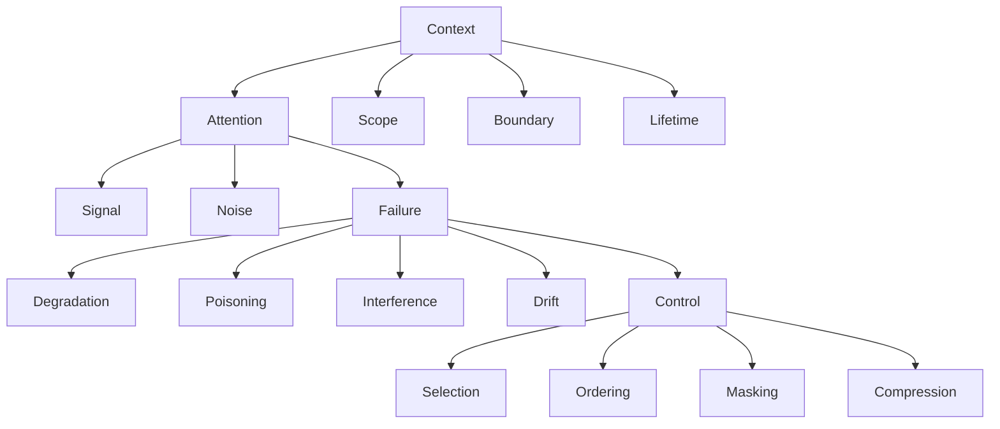

# Glossary

This glossary defines **canonical terms** as they are used in this repository.

Definitions here are **operational**, not linguistic.
If a term is ambiguous in common usage, this glossary resolves that ambiguity for the purpose of this repository.

---

## Core Terms

### Context

The **bounded set of information** made available to a model or agent at a given moment, subject to attention constraints.

Context includes:

- instructions
- retrieved data
- memory
- tool definitions
- intermediate outputs

Context is not unlimited storage. It is a **competitive attention space**.

---

### Attention

The mechanism by which a model allocates limited focus across context elements.

Attention is:

- scarce
- position-sensitive
- non-uniform across the context window

Adding more context does not increase attention capacity.

---

### Signal

Information that **materially influences** model behavior toward an intended outcome.

Signal is defined relative to:

- task intent
- constraints
- decision requirements

Signal is not synonymous with relevance; it is **impactful information under attention limits**.

---

### Noise

Information that **consumes attention without improving outcomes**.

Noise may be:

- redundant
- outdated
- weakly related
- conflicting

Noise is often introduced unintentionally through accumulation.

---

### Scope

The **explicit boundary of what a system is allowed to consider** for a task.

Scope constrains:

- what information may enter context
- what decisions may be made
- what outputs are acceptable

Unscoped systems drift by default.

---

### Boundary

A **hard exclusion rule** that prevents certain information or behaviors from entering or influencing context.

Boundaries differ from scope:

- scope limits _what is considered_
- boundaries prohibit _what must not be considered_

---

### Lifetime

The **temporal validity** of a context element.

Lifetimes determine:

- when information is introduced
- how long it persists
- when it must be removed or refreshed

Expired context is a primary source of silent failure.

---

## Failure Mechanics (terms)

### Degradation

Quality decay from attention overload or accumulation; weak signals get displaced and outputs become unstable.

---

### Interference

Cross-talk between tasks, roles, or channels where lower-authority or out-of-scope inputs displace intended constraints.

---

### Drift

Directional change over time due to stale context, model updates, or reinforcement of outdated assumptions.

---

### Poisoning

Introduction or persistence of malicious or untrusted inputs that alter behavior or authority; often made permanent through persistence.

---

## Control Mechanisms (terms)

### Selection

Admitting or excluding context items based on authority, relevance, freshness, and provenance under a declared budget.

---

### Ordering

Deliberate placement of context to preserve authority and salience; constraints first, then task, then references/background.

---

### Masking

Redaction or removal of sensitive or irrelevant fields (e.g., tool logs) before context admission; preserves provenance while reducing noise.

---

### Compression

Reducing size while preserving required signal and provenance; constraints are non-compressible; summaries validated before use.

---

### Validation

Gate that checks provenance, scope, authority, and freshness before admission or persistence; rejects or quarantines failures.

---

### Isolation

Separating tasks, roles, tenants, tools, and memories to prevent cross-domain influence; enforces channel and authority boundaries.

---

## Governance Terms

### Review

Human validation of changes, behaviors, or artifacts before acceptance; grounded in evidence and checklists.

---

### Acceptance

Formal sign-off that criteria and validations are met; recorded with evidence and approver authority.

---

### Escalation

Defined path for handling violations, ambiguity, or failure conditions; may pause execution and transfer ownership.

---

### Accountability

Traceable ownership of decisions and outcomes, backed by audit logs, provenance, and authority mapping.

---

## System Manifestations

### Memory

Persistent or semi-persistent storage of context; governed by lifetimes, validation, isolation, and provenance.

---

### Tools

External affordances that produce context or actions; bounded by schemas, trust levels, masking, validation, and isolation.

---

### Agents

Autonomous or semi-autonomous processes bound by explicit scope, authority, and allowed actions; outputs validated and logged.

---

### Evaluation

Processes that measure system behavior against defined criteria; isolated from runtime/training; requires rubric, samples, and provenance.

---

## Operational Vocabulary

### Authority Model

Explicit precedence of instructions and sources (e.g., system > developer > task > user > references > tools) that ordering and validation must respect.

---

### Provenance

Trace of where a context element came from (source, time, authority); required for validation, trust, and rollback.

---

### Budget

Declared limit on attention/tokens for a task; governs selection, compression, and ordering decisions.

---

### TTL (Time To Live)

Lifetime bound after which a context element must expire or be refreshed; enforced at admission and persistence.

---

### Channel Boundary

Separation between instruction, data, policy, tool output, and feedback channels to prevent instruction smuggling and authority confusion.

---

### Handoff Artifact

Structured output passed between scoped roles or tasks (e.g., result/status/error), not the upstream prompt; prevents scope bleed.

---

### Constraint

A binding rule that must hold (e.g., safety, policy, authority); must be pinned in ordering and protected from compression or demotion.

---

### Context Assembly

The composed set of context elements (constraints, task, history, retrievals, tool outputs, references) prepared for a model/agent under budgets and controls.

---

## Failure-Related Terms

### Failure

A **predictable breakdown** in system behavior caused by violated constraints, not by randomness.

Failures are structural and repeatable.

---

### Failure Signal

An **observable symptom** indicating that a failure is occurring or imminent.

Signals may be:

- behavioral
- qualitative
- quantitative
- delayed

Absence of signals does not imply absence of failure.

---

### Degradation

Progressive loss of output quality as context grows or attention is diluted.

Often manifests without explicit errors.

---

### Poisoning

Introduction of misleading or adversarial information that corrupts reasoning.

Poisoning can be accidental or intentional.

---

### Interference

Mutual disruption between context elements competing for attention.

Interference increases with unstructured accumulation.

---

### Drift

Gradual deviation from original intent over time or iterations.

Drift is often mistaken for “emergent behavior”.

---

## Control-Related Terms

### Control

An **intentional mechanism** used to constrain, shape, or prioritize context.

Controls do not eliminate failure; they **trade one risk for another**.

---

### Selection

Choosing which information enters context.

Selection is exclusionary by nature.

---

### Ordering

Arranging context elements to influence attention allocation.

Ordering creates implicit priority.

---

### Masking

Preventing certain information from being attended to or used.

Masking hides information without deleting it.

---

### Compression

Reducing information volume while attempting to preserve signal.

Compression always loses information.

---

## System-Level Terms

### Agent

A system component that:

- receives context
- makes decisions
- may invoke tools
- may persist state

Agents are not autonomous by default.

---

### Memory

Persisted information available across interactions.

Memory is a system manifestation, not a primitive.

---

### Tool

An external capability callable by an agent.

Tools extend action space but increase coordination complexity.

---

### Evaluation

A mechanism for assessing outputs, decisions, or behavior.

Evaluation is a system manifestation, not a control.

---

## Governance Terms

### Review

Human inspection of system inputs, outputs, or decisions.

Review exists to catch failures automation cannot detect reliably.

---

### Acceptance

A human decision to allow an output or action to proceed.

Acceptance is an accountability boundary.

---

### Escalation

Routing control to a human when predefined conditions are met.

Escalation is a design choice, not an exception.

---

### Accountability

Explicit assignment of responsibility for system outcomes.

Accountability cannot be delegated to a model.

---

## Conceptual Relationships

The following diagram illustrates how core terms relate across layers:

---

## Terminology Discipline

- Terms defined here must be used consistently.
- If a term is not defined here, it must not be introduced casually.
- Redefinitions require explicit justification and versioning.

---

## Status

This glossary is **stable**.

Additions are permitted only when a new concept cannot be expressed using existing terms.

## Failure Mechanics

### Selection (control)

Admitting or excluding context items based on authority, relevance, freshness, and provenance under a budget.

---

### Ordering (control)

Deliberate placement of context to preserve authority and salience; constraints first, then task, then references.

---

### Masking (control)

Redaction or removal of sensitive/irrelevant fields (e.g., tool logs) before context admission.

---

### Compression (control)

Reducing size while preserving required signal and provenance; non-compressible constraints stay intact.

---

### Validation (control)

Gate that checks provenance, scope, authority, and freshness before admission or persistence.

---

### Isolation (control)

Separating tasks/roles/tenants/tools and their memories to prevent cross-domain influence.

---

### Authority Model

Explicit precedence of instructions and sources (system > developer > task > user > references > tools).

---

### Provenance

Trace of where a context element came from; required for validation, trust, and rollback.

---

### Budget

Declared limit on attention/tokens for a task; governs selection, compression, ordering.

---

### TTL (Time To Live)

Lifetime bound after which a context element must expire or be refreshed.

---

### Handoff Artifact

Structured output passed between scoped roles/tasks (result/status/error), not the upstream prompt.

---
