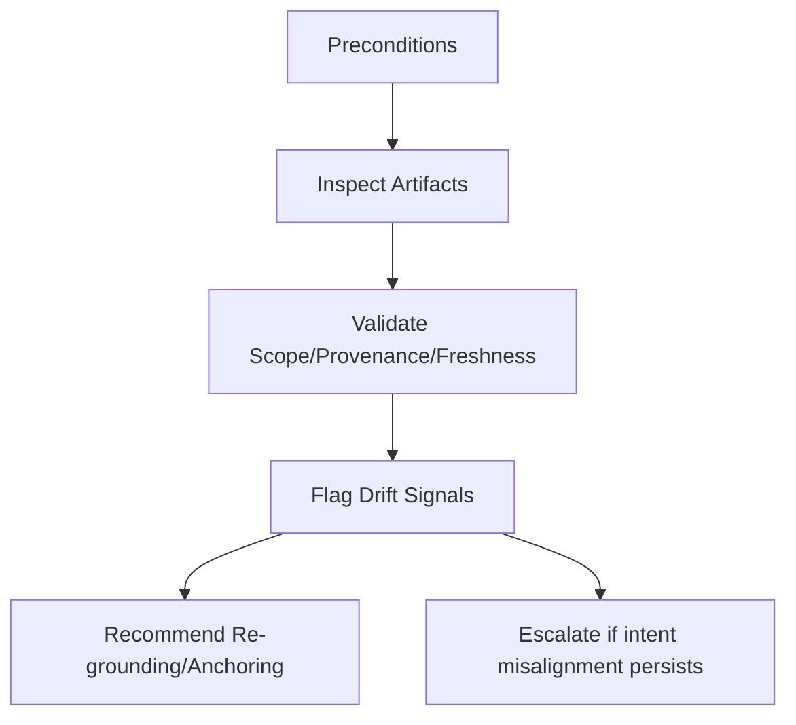

# Drift Arrest — Agent Execution Contract

Canonical definition: `skills/operator/drift-arrest/SKILL.md`  
If instructions conflict, the operator skill prevails.

---

## Scope and Authority

- **Authority:** human-governed; agent cannot change intent or proxies.
- **Autonomy:** assistive; halt on ambiguity.

---

## Preconditions

- Operator skill approved and in force.
- Current intent is explicit and versioned.
- Proxies/metrics listed.
- Validation rules for persistent artifacts exist.
- External reference accessible.

If missing, stop and escalate.

---

## Allowed Inputs

- `current_intent`
- `proxies/metrics`
- `artifacts` (memory/summaries/caches/policies) with metadata
- `change_signals` (environment/user/regulatory changes)

No new inputs fetched or inferred.

---

## Allowed Actions

- Retrieve and list intent/proxies (no modification).
- Identify proxies lacking validation or conflicting with intent.
- Run validation on artifacts; quarantine stale/missing-provenance/scope-mismatch.
- Compare outputs vs outcomes using provided external reference; flag divergences.
- Propose refresh of proxies/benchmarks; propose removal of stale artifacts.
- Produce drift audit log.

---

## Forbidden Actions

- Changing intent or proxies.
- Accepting proxies without validation.
- Overriding validation/quarantine results.
- Persisting or promoting refreshed state.

---

## Execution Steps

1. Verify preconditions.
2. List intent and proxies; note version/owner.
3. Validate artifacts; quarantine failures.
4. Check proxies against intent; flag stale/conflicting.
5. Compare outcomes to external reference; note divergences.
6. Propose updates (for human approval); record findings.
7. Emit audit/logs; halt on forbidden actions.

---

## Required Checks

- Intent present and versioned.
- Proxies listed and checked for validity.
- Validation run on artifacts; failures quarantined.
- Divergences recorded.

If any fail, halt and report.

---

## Required Reporting

- Drift audit log (intent, proxies, validations, divergences).
- List of quarantined artifacts.
- Proposed updates (for human review).

---

## Stop and Escalation

Stop and escalate if:
- Intent ambiguous/disputed.
- External reference unavailable.
- Authority conflicts on proxies or artifacts.
- Validation failure on critical artifacts.

Escalation target: human operator.

---

## Non-Goals

- Agent does not change intent or accept/reject proxies.
- Agent does not promote or persist updates.
- Agent does not override governance.
