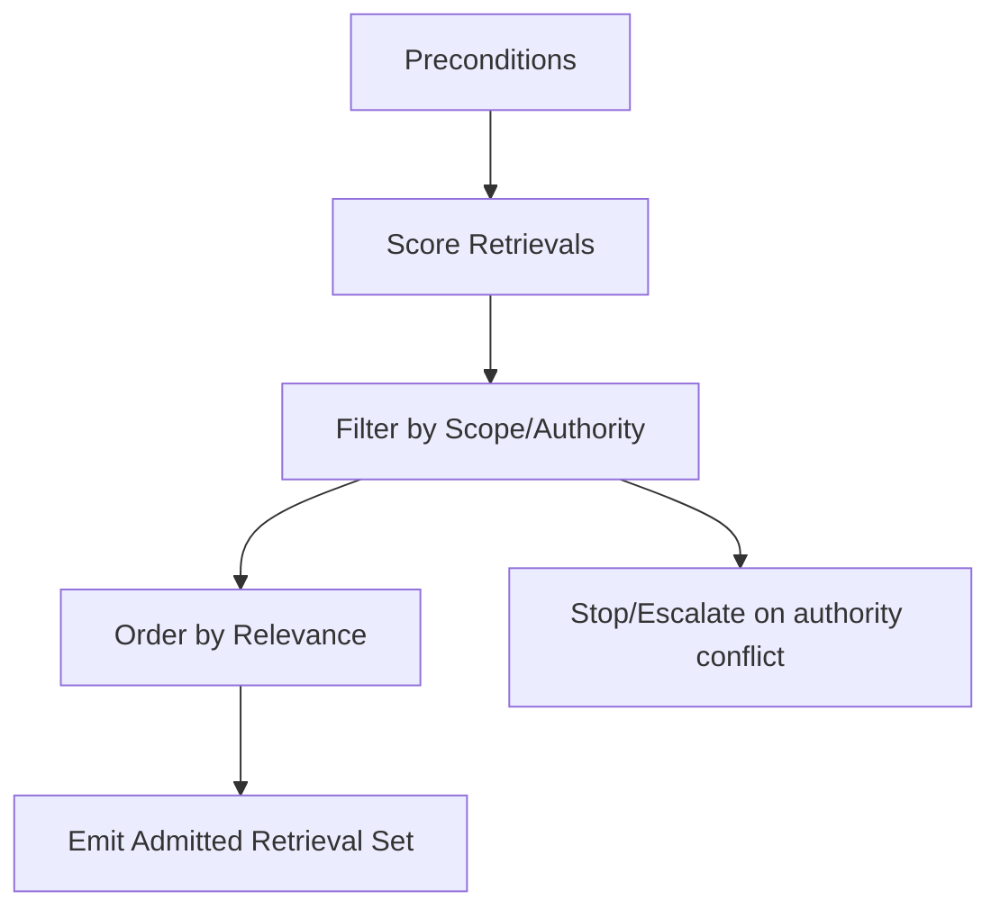

# Retrieval Gating — Agent Execution Contract

Canonical definition: `skills/operator/retrieval-gating/SKILL.md`  
If instructions conflict, the operator skill prevails.

---

## Scope and Authority

- **Authority:** human-governed; agent cannot change source policy or scope.
- **Autonomy:** constrained; halt on ambiguity or policy conflicts.

---

## Preconditions

- Operator skill approved and in force.
- Source allowlist/denylist and authority model provided.
- Relevance criteria and retrieval budget provided.
- Validation rules for retrieved artifacts exist.

If missing, stop and escalate.

---

## Allowed Inputs

- `retrieved_candidates[]` with source/score/metadata
- `retrieval_budget`
- `relevance_criteria`
- `source_policy` (allow/deny, authority)

No fetching or fabricating inputs.

---

## Allowed Actions

- Normalize candidates; tag source/authority/timestamp if provided.
- Apply source policy (allow/deny/trust tier).
- Apply relevance and scope filters per task/phase.
- Deduplicate; keep highest authority/score instance.
- Compress long items if allowed; retain provenance.
- Enforce budget (authority + relevance order).
- Validate provenance/scope before admission; quarantine UNKNOWN.
- Produce admitted set and exclusion log.

---

## Forbidden Actions

- Change source policy or authority model.
- Admit denied/unknown sources without approval.
- Override budget.
- Expand scope/relevance beyond provided criteria.
- Persist or cache outputs.

---

## Execution Steps

1. Verify preconditions.
2. Normalize and tag candidates.
3. Apply source policy; exclude/quarantine denied/unknown.
4. Apply relevance/scope gating.
5. Deduplicate and compress (if allowed).
6. Enforce budget; admit in authority+relevance order.
7. Validate admitted items; quarantine failures.
8. Emit outputs; halt on forbidden actions.

---

## Required Checks

- Budget respected.
- No denied/unknown sources admitted.
- Out-of-scope items excluded.
- Provenance present for admitted items.
- Authority ordering preserved.

If any fail, halt and report.

---

## Required Reporting

- Admitted retrievals (ordered).
- Exclusion/quarantine log with reasons.
- Provenance report.
- Budget utilization.

---

## Stop and Escalation

Stop and escalate if:
- Unknown/denied source required.
- Scope/relevance ambiguous.
- Validation fails for required items.
- Authority conflicts arise.

Escalation target: human operator.

---

## Non-Goals

- Agent does not change policy or authority.
- Agent does not persist or cache results.
- Agent does not expand retrieval scope.
