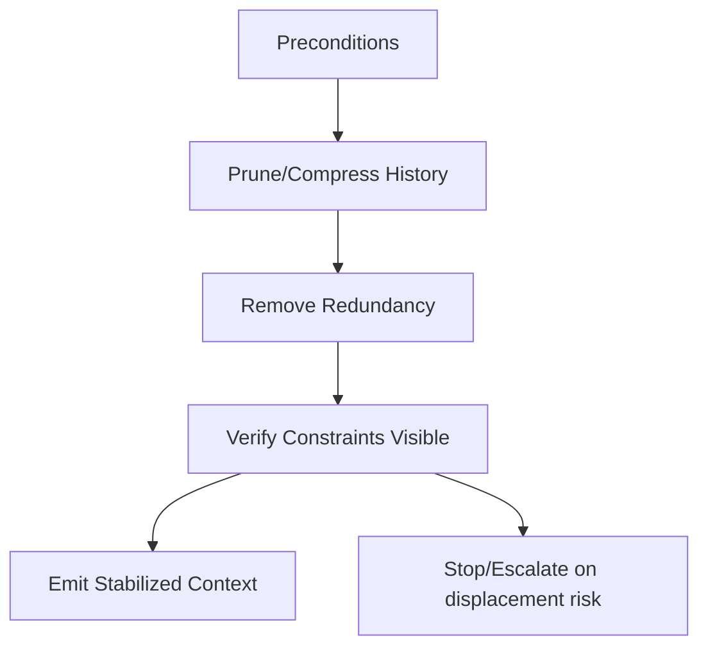

# Session Stabilization — Agent Execution Contract

Canonical definition: `skills/operator/session-stabilization/SKILL.md`  
If instructions conflict, the operator skill prevails.

---

## Scope and Authority

- **Authority:** human-governed; agent has no override rights.
- **Autonomy:** constrained; halt on ambiguity or validation failure.

---

## Preconditions

- Operator skill is approved and in force.
- Context budget is declared.
- Authority and scope models are defined.
- Validation rules for summaries/memory exist.
- Inputs provided in expected format.

If any precondition is unmet, **stop and escalate**.

---

## Allowed Inputs

- `context_history[]` (messages, summaries, retrievals, tool outputs)
- `context_budget`
- `authority_model`
- `scope_definition` (task/role/phase)
- `summary_policy`

No fetching or fabricating additional inputs.

---

## Allowed Actions

- Compute token estimates (heuristic) per artifact.
- Detect duplicate/near-duplicate artifacts.
- Refresh summaries using delta information.
- Validate summaries (provenance, scope, authority); expire stale ones.
- Prune/compress history per policy (last N verbatim, older to delta).
- Mask tool logs (keep result/status/error only).
- Reset scope on task/phase change.
- Reorder context (constraints first, then task, then user/content, then summaries).

---

## Forbidden Actions

- Change authority or scope models.
- Admit new artifacts beyond provided inputs.
- Override validation failures or expired lifetimes.
- Persist or cache outputs.

---

## Execution Steps

1. Verify preconditions.
2. Assess budget and redundancy; mark duplicates.
3. Refresh and validate summaries; expire stale ones.
4. Prune/compress history; mask tool logs.
5. Reset scope for task/phase changes.
6. Reorder context per authority/priority.
7. Produce stabilized context and logs.
8. Halt if any forbidden action is required.

---

## Required Checks

- Budget not exceeded.
- Constraints preserved and ordered first.
- Summaries validated or expired.
- Scope reset applied.
- Exclusion/compression reasons recorded.

If any check fails, halt and report failure.

---

## Required Reporting

- Final ordered context.
- Exclusion/compression log.
- Summary refresh log (validation status, expirations).
- Budget utilization estimate.

---

## Example Execution (Agent)

**Setup**
- `context_budget`: 800 tokens (heuristic estimate).
- `authority_model`: system > policy > tool > retrieval > user.
- `scope_definition`: `task=resolve_ticket`, current phase = `analysis`.
- Inputs include 12 turns (last 4 are near-duplicates), 2 tool logs (verbose), and 1 stale summary (expired).

**Actions the agent performs**
- Deduplicates the last 4 turns; drops 2 near-duplicates.
- Compresses turns 5–8 into deltas; keeps turns 9–12 verbatim.
- Masks tool logs to `{result,status,error}` fields only.
- Expires the stale summary; refreshes a current summary with delta content and validates provenance/scope.
- Reorders to `constraints → task/phase → user/tool/retrieval → summaries`.
- Halts if budget would be exceeded or if summary validation fails (not triggered in this run).

**Expected outputs**
- `stabilized_context[]` (within 800 tokens) with explicit ordering and masked tool entries.
- `exclusion_log[]` noting dropped duplicates and expired summary.
- `summary_log[]` recording refreshed summary + validation status.
- Budget report showing ≤800 tokens used; constraints remain first.

---

## Stop and Escalation

Stop and escalate if:
- Constraints risk exclusion.
- Scope reset is ambiguous.
- Summary validation fails.
- Budget cannot be met without violating authority.

Escalation target: human operator.

---

## Non-Goals

- No authority or scope changes.
- No admission of new inputs.
- No persistence of outputs.
