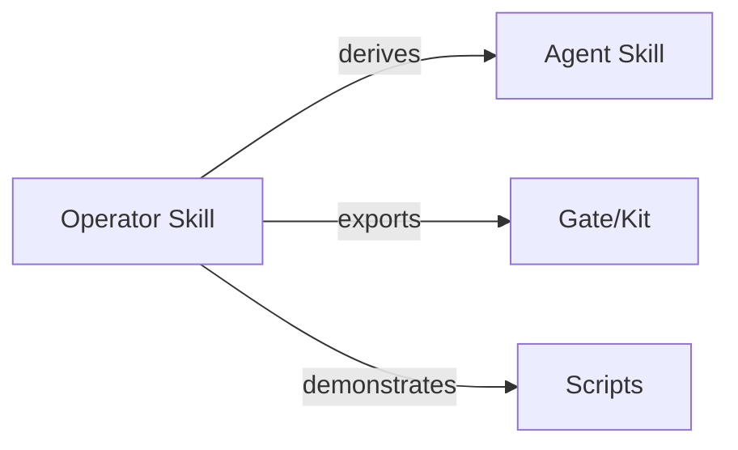

# Skills Index

This index lists all skills available in this repository.

Each skill exists in two forms:

- **Operator skill**: canonical, human-executed
- **Agent skill**: derived, constrained, pasteable

Operator skills define truth.  
Agent skills inherit constraints.

---

## Core Skills

| Skill | Operator | Agent | Primary Controls | Failure Classes |
|------|---------|-------|------------------|-----------------|
| Context Triage | `operator/context-triage/` | `agent/context-triage.md` | selection, ordering | degradation, interference |
| Session Stabilization | `operator/session-stabilization/` | `agent/session-stabilization.md` | compression, ordering | degradation, drift |
| Boundary Hardening | `operator/boundary-hardening/` | `agent/boundary-hardening.md` | masking, isolation | interference, poisoning |
| Drift Arrest | `operator/drift-arrest/` | `agent/drift-arrest.md` | validation, lifetimes | drift |
| Retrieval Gating | `operator/retrieval-gating/` | `agent/retrieval-gating.md` | selection, validation | poisoning, degradation |

---

## Kits and Gates

Minimal copy-paste control artifacts.

| Gate | Control | Failure Class |
|-----|--------|---------------|
| Selection Gate | selection | degradation |
| Ordering Policy | ordering | interference |
| Masking Map | masking | poisoning |
| Validation Rule | validation | drift |
| Isolation Boundary | isolation | interference |

See `skills/kits/gates/00-index.md` for details.

---

## Usage rules

- Start with **operator skills** when designing or debugging systems
- Use **agent skills** only after constraints are understood
- Use **gates** when guardrails are needed without full procedures

This index is intentionally thin.  
All operational detail lives in the linked skill directories.
