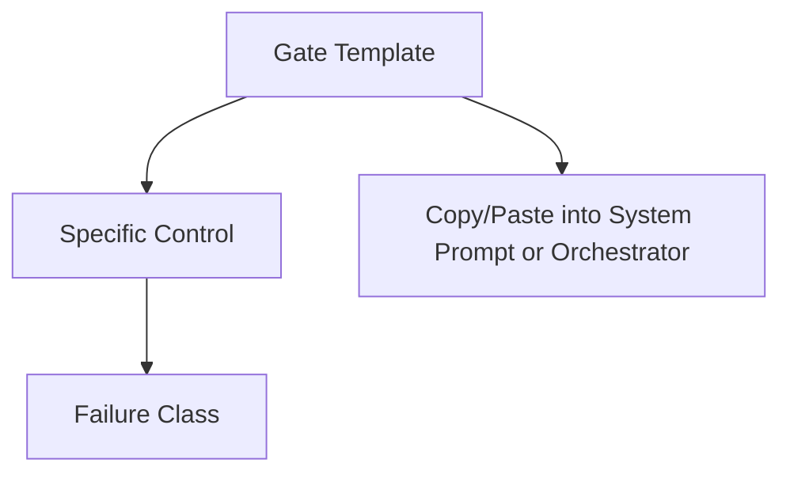

# Kits and Gates

Kits provide the smallest reusable control artifacts. They are intentionally narrow and copy-paste safe.

Use gates when you need a **single control** without the surrounding skill.
