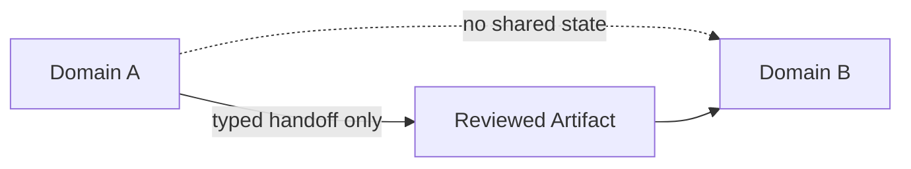

# Isolation Boundary

Use this gate to **prevent any cross-domain influence** between contexts, agents, or environments.

**Inputs**: boundary definition (domains, allowed handoffs)  
**Outputs**: enforcement rules + verification checklist

**Stop if** a non-reviewed path would be required to proceed or if the boundary is bypassable.
