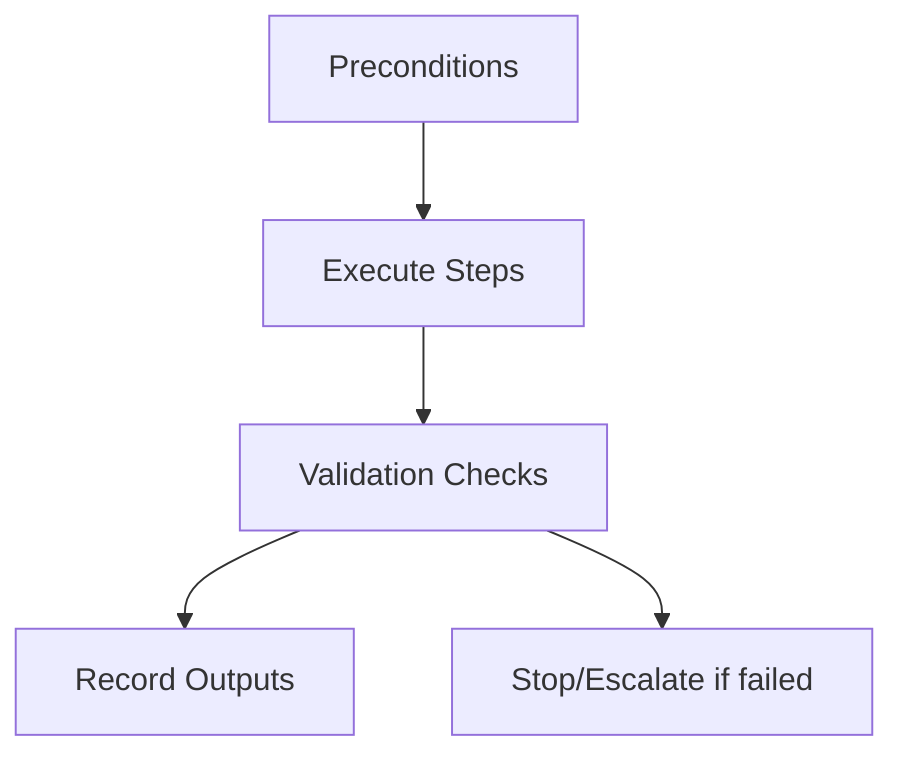

# <Skill Name> — Operator Checklist

This checklist is a **condensed execution aid** for experienced operators.  
It does not replace the canonical procedure in `SKILL.md`.

Use this only when the skill is already understood.

---

## Preconditions (verify before starting)

- [ ] Preconditions copied from the operator skill
- [ ] Scope and authority confirmed
- [ ] Inputs available and trusted
- [ ] No outstanding escalations

If any item is unchecked, **do not proceed**.

---

## Execution Checklist

1. **Normalize inputs** — outline steps briefly.
2. **Apply controls** — selection/ordering/masking/validation as required.
3. **Enforce budgets/limits** — note explicit constraints.
4. **Produce outputs** — ordered artifacts, logs, or reports.

Customize these bullets per skill.

---

## Validation Checks (must pass)

- [ ] Checks mirrored from `SKILL.md`
- [ ] Authority and scope preserved
- [ ] Evidence recorded (timestamps, results)

---

## Stop and Escalation Conditions

- [ ] Violated authority or scope boundaries
- [ ] Missing or untrusted inputs
- [ ] Required check failed
- [ ] Budget/limit breach affecting constraints

Escalate to the owner named in `SKILL.md`.

---

## Output Artifacts (record)

- [ ] Final outputs (context list, plan, report, etc.)
- [ ] Exclusion/decision log
- [ ] Validation results

---

## Reminder

- Do not improvise beyond the operator skill.
- If in doubt, stop and escalate.
