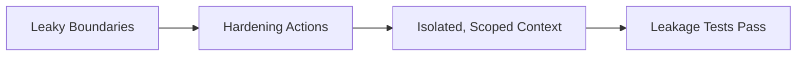

# Boundary Hardening — Before / After

## ✅ Acceptable Execution

- **Before:** user instructions occasionally override policy; retrieved docs bleed into execution role.
- **Intervention:** mapped authority and scope, added role-based masking, isolated retrieval to advisory lane, retested leakage.
- **After:** policy persists across runs; retrieval cannot override constraints; leakage tests pass.

## ❌ Incorrect Execution

- **Before:** mixed system/user/tool content in shared buffer.
- **Error:** added more instructions but left shared buffer intact.
- **Outcome:** interference persisted; constraints still overwritten.
- **Correction:** apply isolation/masking instead of additive prompts; rerun leakage checks.
