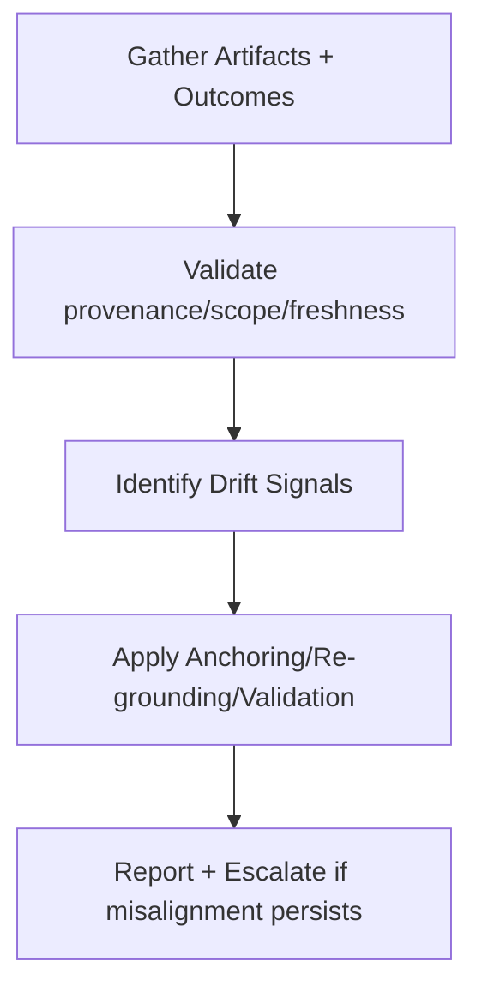

# Drift Arrest

## Overview

Drift Arrest is the intervention used to **detect and correct directional misalignment** when a system remains confident but diverges from intent.

The skill revalidates intent, proxies, and assumptions, and enforces lifetimes and external grounding.

---

## Why It Matters

Drift appears as stable but wrong behavior.  
Without arrest:
- proxy success replaces intent
- outdated assumptions persist
- environment changes go unnoticed
- internal metrics stay “green” while outcomes fail

Drift Arrest mitigates:
- **drift**
- **poisoning** (via validation)
- **interference** (when scope/authority conflicts arise)

---

## Audience, Scope & Personas

- **Primary operator:** platform engineers, applied ML engineers, governance leads
- **Reviewer / approver:** system owner, governance lead
- **Out of scope:** model training, embedding design, user research

---

## Prerequisites

- Current intent and success criteria documented
- Authority model defined; external ground truth available or accessible
- Validation rules for persistent artifacts in place
- Mechanisms to refresh proxies/benchmarks exist

---

## Security, Compliance & Privacy

- External data used for re-grounding must meet compliance rules
- Provenance and authority must be preserved when refreshing state
- Drift fixes must not bypass governance

---

## Tasks & Step-by-Step Instructions

### Inputs (required)

- `current_intent` — documented, versioned intent
- `proxies/metrics` — current success proxies and benchmarks
- `artifacts` — summaries, memories, policies influencing decisions
- `change_signals` — environment/user/regulatory changes

---

### Procedure

1. **Confirm intent and scope**
   - Retrieve current intent; ensure it is explicit, versioned, and owned.
   - Identify domains where intent might have shifted.

2. **Audit proxies and benchmarks**
   - List all proxies/metrics used for “success.”
   - Validate that they still represent intent; mark stale/invalid.

3. **Validate persistent artifacts**
   - Run validation on memory, summaries, cached retrievals.
   - Reject or quarantine artifacts with stale lifetime, missing provenance, or scope mismatch.

4. **Re-ground with external reference**
   - Bring in current external data/policy as ground truth.
   - Compare outputs against outcomes; record divergence.

5. **Update constraints and state**
   - Restate intent if legitimately changed (with approval).
   - Refresh proxies/benchmarks; invalidate obsolete ones.
   - Roll back or replace poisoned/stale artifacts.

6. **Re-run checks**
   - Confirm drift signals are cleared (outcome–intent alignment restored).
   - Ensure authority and scope are preserved after updates.

---

### Outputs (required)

- `drift_audit_log` — findings on intent/proxies/artifacts, actions taken
- `updated_intent/proxies` — refreshed statements and metrics with versioning
- `validation_log` — artifacts rejected/quarantined/refreshed with reasons

---

## Access Control & Permissions

- Execution: designated operators
- Approval: required to change intent, proxies, or promote refreshed artifacts
- Agents may not:
  - redefine intent
  - accept proxies without validation
  - override quarantine/validation results

---

## Practical Examples & Templates (✅ / ❌)

### ✅ Acceptable execution
- Intent confirmed and versioned; proxies revalidated
- Stale memory entries quarantined; refreshed with current truth
- Benchmarks updated; drift signals cleared

### ❌ Incorrect execution
- Proxies kept despite conflict with outcomes
- Intent assumed static; stale policy persists
- Drift “fixed” by prompt tweaks without revalidation

---

## Known Issues & Friction Points

- Stakeholder resistance to intent changes
- Hidden proxies embedded in code/prompts
- Overconfidence in internal metrics
- Missing external ground truth

---

## Troubleshooting Guidance

- **Symptom:** metrics green, users complain → inspect proxies vs outcomes; re-ground
- **Symptom:** repeating stale assumptions → enforce lifetimes; validate memory
- **Symptom:** stable but wrong outputs → check intent alignment and proxies

Escalate if:
- intent is ambiguous or disputed
- external truth unavailable or non-authoritative
- required approvals for intent changes are missing

---

## Dependencies, Risks & Escalation Path

- **Dependencies:** validation, isolation, selection (for updated artifacts)
- **Risks:** over-correction without stakeholder alignment; loss of historical continuity
- **Escalation:** governance lead/system owner for intent/proxy changes

---

## Success Metrics & Outcomes

- Outcome–intent alignment restored (audited)
- Proxies/benchmarks refreshed and versioned
- Stale/poisoned artifacts removed or quarantined
- Drift signals cleared in subsequent checks

---

## Resources & References

- `20-failure-mechanics/drift/00-spec.md`
- `20-failure-mechanics/drift/01-failure-signals.md`
- `30-control-mechanisms/validation/00-spec.md`
- `10-primitives/lifetimes/00-spec.md`
- `10-primitives/scope/00-spec.md`

---

## Agent Applicability (Derived Form)

- **Eligible for agent execution:** limited (assistive)
- **Allowed agent actions:** gather proxies/metrics; run validation; identify stale artifacts; propose updates
- **Forbidden agent actions:** change intent; accept/reject proxies; override validation
- **Required reporting:** drift signals found; artifacts quarantined; proposed refresh list
- **Stop and escalate:** intent ambiguity; missing external reference; conflicting authority
