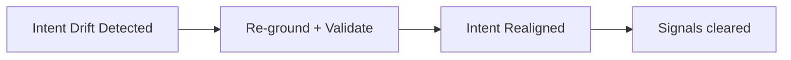

# Drift Arrest — Before / After

## ✅ Acceptable Execution

- **Before:** system passes internal metrics but users report misaligned outputs; proxies unchanged for months.
- **Intervention:** refreshed intent statement, revalidated proxies, expired stale memory, added outcome audits.
- **After:** outputs realigned with intent; metrics updated; drift signals resolved.

## ❌ Incorrect Execution

- **Before:** conflicting user reports vs metrics.
- **Error:** tightened ordering only; no revalidation of proxies or assumptions.
- **Outcome:** drift persists; misalignment remains invisible to metrics.
- **Correction:** run full drift arrest (re-grounding, validation, audit) before changing ordering.
