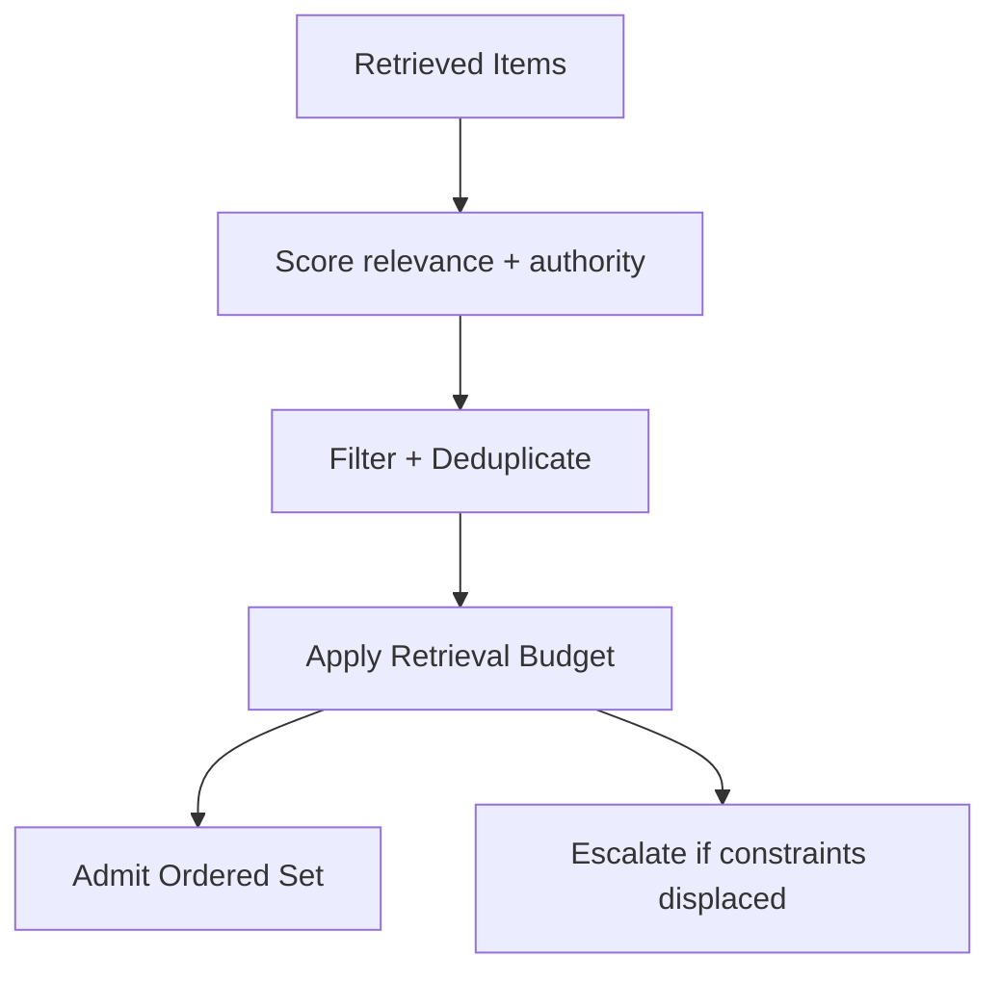

# Retrieval Gating

## Overview

Retrieval Gating is the intervention used to **control what retrieved content is admitted, how much, and under what authority**.

The skill enforces relevance, scope, and trust tiers before retrieval enters active context.

---

## Why It Matters

Unbounded retrieval causes degradation and poisoning.  
Without gating:
- irrelevant or verbose docs displace constraints
- malicious or outdated sources enter context
- attention collapses under recall volume
- authority conflicts emerge from retrieved content

Retrieval Gating mitigates:
- **degradation**
- **poisoning**
- **interference**

---

## Audience, Scope & Personas

- **Primary operator:** platform engineers, applied ML engineers
- **Reviewer / approver:** system owner, governance lead
- **Out of scope:** retrieval algorithm design, embedding/model tuning

---

## Prerequisites

- Authority model defined for retrieval sources
- Relevance criteria established (task/phase/role)
- Retrieval budget declared (top-K or token budget)
- Validation rules for retrieved artifacts in place
- Allowed source list/denylist available

---

## Security, Compliance & Privacy

- Enforce source allowlists/denylists
- Tag provenance and authority for every retrieved chunk
- Mask or reject content that violates policy or scope

---

## Tasks & Step-by-Step Instructions

### Inputs (required)

- `query` — retrieval query intent
- `retrieved_candidates[]` — documents/snippets with metadata (source, score, timestamp)
- `retrieval_budget` — max items/tokens to admit
- `relevance_criteria` — task/phase relevance rules
- `source_policy` — allowlist/denylist, authority tags

---

### Procedure

1. **Normalize and tag**
   - Ensure each candidate has source, authority, timestamp, scope labels (if provided).
   - Assign default low authority to untrusted/unknown sources.

2. **Filter by source policy**
   - Exclude candidates from denied or unknown sources.
   - Apply trust tiering per authority model.

3. **Relevance and scope gating**
   - Apply relevance scoring/thresholds per task/phase.
   - Exclude out-of-scope content; do not summarize to “force fit.”

4. **Deduplicate and compress**
   - Remove near-duplicates; keep highest-authority or best-scored instance.
   - Optionally compress long but relevant sections (maintain provenance).

5. **Enforce budget**
   - Admit candidates in order of authority + relevance until budget is reached.
   - Reject or defer the rest; do not partially admit without explicit rules.

6. **Validate before admission**
   - Validate provenance, authority, scope; reject UNKNOWN.
   - Quarantine questionable items for human review.

7. **Produce gated retrieval set**
   - Ordered, within budget, with provenance tags.
   - Record exclusions and reasons.

---

### Outputs (required)

- `admitted_retrievals[]` — ordered, validated, within budget
- `exclusion_log[]` — excluded items and reasons (source, scope, relevance, budget)
- `provenance_report` — sources and authority levels admitted

---

## Access Control & Permissions

- Execution: designated operators
- Approval: required to admit unknown/denied sources or exceed budget
- Agents may not:
  - override source policy
  - admit UNKNOWN provenance
  - expand retrieval scope without approval

---

## Practical Examples & Templates (✅ / ❌)

### ✅ Acceptable execution
- Allowed sources only; duplicates removed; budget enforced
- Low-signal/background excluded; constraints remain visible
- Unknown sources quarantined; provenance retained

### ❌ Incorrect execution
- Admitted retrievals from unknown/denied sources
- Relevance gating skipped; verbose background displaces constraints
- Budget ignored; context saturation

---

## Known Issues & Friction Points

- Over-filtering weak but critical signals
- Missing or incorrect metadata from retrieval pipeline
- Latency added by validation/quarantine steps

---

## Troubleshooting Guidance

- **Symptom:** constraints ignored → check budget and ordering vs retrieval volume
- **Symptom:** poisoning/odd behavior → inspect provenance; unknown sources admitted?
- **Symptom:** irrelevant answers → tighten relevance/ scope filters

Escalate if:
- source policy conflicts with task needs
- authority unclear for a source
- validation repeatedly fails for required content

---

## Dependencies, Risks & Escalation Path

- **Dependencies:** selection, ordering, compression, validation
- **Risks:** omission of rare but important facts; latency from gating
- **Escalation:** system owner/governance lead for policy/authority exceptions

---

## Success Metrics & Outcomes

- Retrieval budget respected
- Zero unknown/denied sources admitted
- Reduced redundancy in retrieval set
- Improved adherence to constraints post-gating

---

## Resources & References

- `10-primitives/signal-vs-noise/00-spec.md`
- `10-primitives/attention/00-spec.md`
- `30-control-mechanisms/selection/00-spec.md`
- `30-control-mechanisms/validation/00-spec.md`
- `30-control-mechanisms/compression/00-spec.md`
- `30-control-mechanisms/ordering/00-spec.md`

---

## Agent Applicability (Derived Form)

- **Eligible for agent execution:** partial
- **Allowed agent actions:** apply source policy; relevance/score filter; dedupe; enforce budget; tag provenance
- **Forbidden agent actions:** change source policy; admit UNKNOWN/denied sources; override budget
- **Required reporting:** admitted vs excluded, reasons, budget usage, provenance
- **Stop and escalate:** unknown/denied source needed; scope/relevance ambiguous; validation fails
