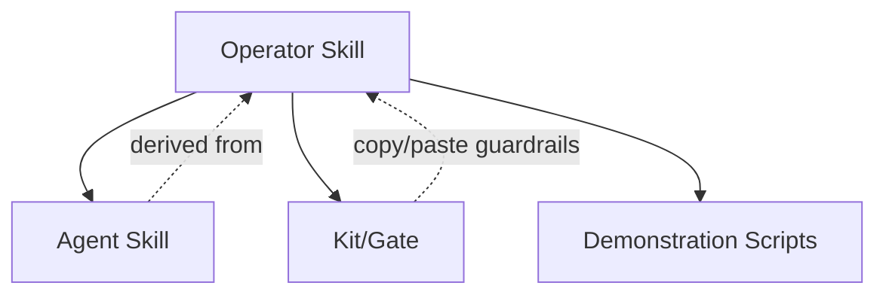

# Skills

This directory contains **skills**.

In this repository, a **skill** is a governed execution unit.  
A skill describes *how an intervention is performed*, not *what an agent is capable of*.

Skills may be executed by humans or by agents.  
**Authority never resides with the agent.**



---

## What a skill is (in this repo)

A skill is:

- A bounded execution procedure
- Designed to intervene in context behavior
- Governed by explicit constraints
- Verifiable through checks and failure signals
- Safe to copy and paste

A skill is **not**:

- A prompt
- A capability claim
- A best-practice guide
- A recommendation
- An autonomous decision-maker

---

## Skill taxonomy

Skills are divided into three categories:

```

skills/
├── operator/   # Canonical, human-executed skills
├── agent/      # Derived, agent-executed skills
└── kits/       # Minimal copy-paste control artifacts (gates)

```

Each category serves a distinct role.

---

## Operator skills (canonical)

Operator skills are the **source of truth**.

They are written for humans who design, debug, and govern AI systems.

Operator skills:

- Define intervention logic
- Specify required inputs
- Encode validation and acceptance criteria
- Document known failure modes
- Constrain agent execution

If there is a conflict between operator and agent skills,  
**the operator skill is correct**.

### Structure

```
skills/operator/<skill-name>/
├── SKILL.md        # Canonical procedure
├── checklist.md    # Condensed execution checklist
├── scripts/        # Demonstration scripts (illustrative)
└── examples/       # Before/after artifacts
```

---

## Agent skills (derived)

Agent skills are **execution contracts** derived from operator skills.

They are designed to be:

- Pasteable into agent platforms
- Deterministic
- Explicitly constrained

Agent skills:

- Never introduce new logic
- Never expand scope
- Never override authority or validation rules

Each agent skill explicitly references its originating operator skill.

---

## Kits and gates

Kits provide the smallest reusable control artifacts.

A gate is:

- A single control mechanism
- Bound to one failure class
- Safe to paste into system prompts or orchestrators
- Non-overridable by agents

Gates exist for teams that want guardrails without full skills.

---

## Scripts

Scripts are **demonstrations**, not libraries.

They exist to:

- Prove executability
- Show concrete before/after behavior
- Illustrate control mechanics

Scripts:

- Are intentionally simple
- Avoid external dependencies where possible
- Do not define authority or policy
- Must not be treated as production code

Each script is scoped to a specific operator skill or control.

---

## Copy-paste safety rules

All copy-paste artifacts in this directory must include:

- Explicit preconditions
- Allowed and forbidden actions
- Required checks
- Stop and escalation conditions
- Declared, non-overridable authority

Artifacts missing these elements are incomplete.

---

## How to use this directory

- **Humans**: start in `skills/operator/`
- **Agents**: consume only from `skills/agent/`
- **Platform integrators**: use `skills/kits/`

Do not mix these roles.

---

## Design intent

This skills system exists to make context engineering:

- Executable
- Auditable
- Governable

Not easier.  
Not automatic.  
Not autonomous.
